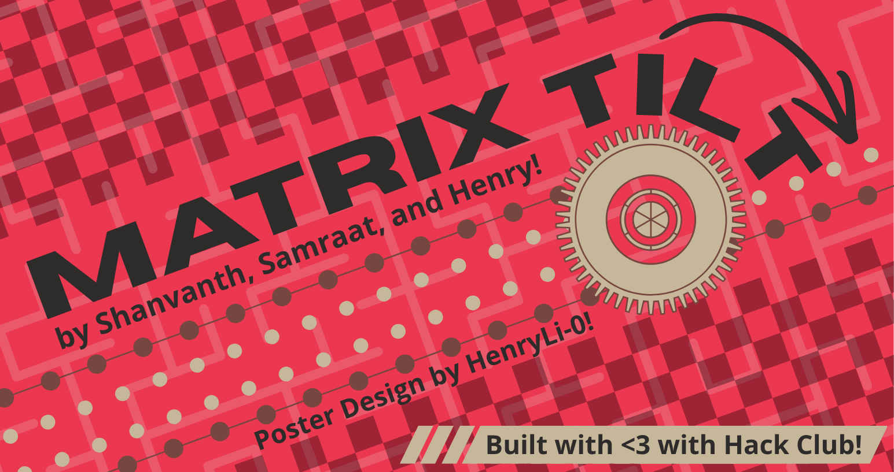

    <h2>Matrix Tilt</h2>
    

---

### Matrix Tilt

An interactive 2DOF (rotational) LED matrix with a wireless hand controller!

---

### What's this?
*well, let's get to more specifications*

The LED matrix section of this project involves two NEMA17 37mm and an additional two NEMA17 48mm stepper motors. With this, the setup is able to rotate in two axis, with the 48mm stepper motors leading the first rotation and the 37mm stepper motors assisting in the second. The LED matrix is comprised of six 8x8 LED matrix panels, resulting in a total resolution of 16x24, allowing us to make bright yet decently detailed graphics! Back to the motion system, both rotations contain buttons on either maximum and minimum ends for zeroing and safety limits, keeping the system accurate and in functional limits! Returning to the 384 WS2812B LEDs, they're controlled by an ESP32-C3 running custom Arudino code! The ESP32-C3 also controls a XIAO RP2040 via UART communication, allowing it to also control the stepper motors as well. This is all then tightly cleaned and compacted into the main setup!

The ESP32-C3 also communicates wirelessly with an additional handheld controller, which uses a BMI160 accelerometer/gyroscope to measure the orientation. With this, the user can control the rotation of the board from a distance, allowing extra interactivity with the mechanism!

Given the open source nature and easy to use code, this board can display an incredibly wide range of interactive graphics, from games involving mazes and grid structures, to particle simulations to displaying funny GIFs! With 16M+ colors per LED, the possibilities are truly endless!

---

### Pictures

---

### BOM

*Note that a lot of these parts were given/sourced by Hack Club! Therefore, a fully accurate BOM price can't be calculated as of now, but most parts can be sourced fairly cheap from vendors such as AliExpress!*

| Part                          | Quantity  | 
|-------------------------------|-----------|
| NEMA17 Motors (37mm)          | 2         |
| NEMA17 Motors (48mm)          | 2         |
| Bearing (14mm OD, shaft ID)   | 2         |
| NEMA17 Shaft Collar           | 2         |
| USB C Power Delivery Module   | 1         |
| USB C Cable and Outlet Brick  | 1         |
| A4988 Stepper Drivers         | 2         |
| 8x8 WS2812B LED Matrix        | 6         |
| ESP32C3 MakerGo SuperMini     | 2         |
| XIAO RP2040                   | 1         |
| Push Buttons/Limit Switches   | 4         |
| Breadboards                   | 2         |
| Breadboards (but fancier)     | 1         |
| Jumper Wires                  | Abundance |
| Hot Glue                      | Abundance |
